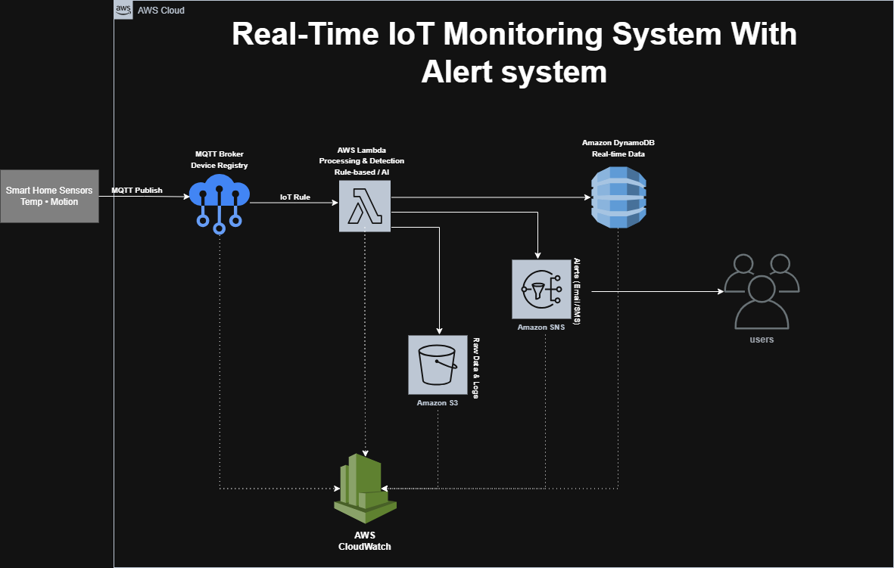

# 🏠 IoT Smart Home Monitoring System - AWS
Proyek UAS Cloud Computing - Teknik Informatika UPR 2026.

## 👥 Anggota Kelompok
* **Bramatio Manjin** (2330205030052) - Cloud Architect
* **Ciko Christian** (2330205030059) - DevOps Engineer
* **Gregio Rafael L. J.** (2330305030072) - Backend & Security

## 📊 Arsitektur Sistem (Final Minggu 1)

## 📄 Dokumen Proyek
- [📖 Laporan Perencanaan Proyek (PDF)](docs/Dokumen_Perencanaan_Proyek_.pdf)
- [💰 Estimasi Biaya AWS - $3.82/Bulan (PDF)](docs/Estimasi_Biaya_AWS.pdf)

## 🛠️ Detail Layanan (AWS Singapore Region)
- [cite_start]**AWS IoT Core**: Gateway MQTT untuk sensor (43.200 pesan/bulan). [cite: 5]
- [cite_start]**AWS Lambda**: Pemrosesan logika dan deteksi anomali (43.200 request/bulan). [cite: 5]
- [cite_start]**Amazon CloudWatch**: Monitoring dashboard untuk 5 metrik sensor (Suhu, Kelembapan, Gerak, Gas, Lampu). [cite: 5]
- [cite_start]**Amazon DynamoDB & S3**: Penyimpanan data real-time dan arsip log (Standard Storage 1 GB). [cite: 5]
- **Amazon SNS**: Pengiriman notifikasi peringatan (Email/SMS).